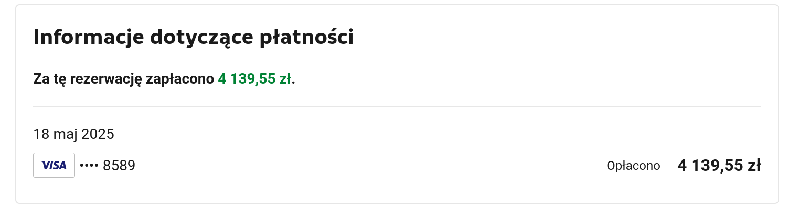
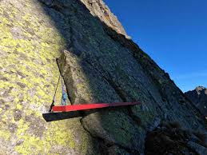
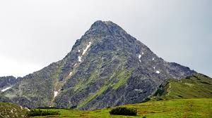
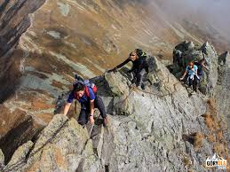
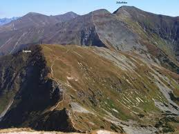
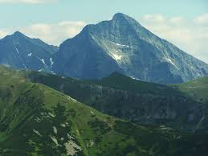

Dzień rozpoczęcia: 2025-06-19
Data zakończenia: 2025-06-29
# TODO
- [x] Ubezpieczenie turystyczne na Słowację
- [x] Zarezerwować wynajem samochodu
- [ ] Winieta na autostradę - momencie gdy będę znał numer rejestracyjny (można w Ustroniu)
	- [ ] https://winiety-online.pl/ lub https://eznamka.sk/en
# Plan
* Wyjazd do Ustronia Sob 2025-06-14 -  Pt 2025-06-20
	* [Sanatorium Artura](https://maps.app.goo.gl/xgrRHm4oWSPmnCFE7)
	* [Trasa](https://maps.app.goo.gl/qeUcr7MDdU1kgpDt6) 8:00 - 13:00
	* [Potwierdzenie](https://secure.booking.com/confirmation.en-us.html?label=gen173nr-1FCAEoggI46AdIM1gEaLYBiAEBmAExuAEZyAEP2AEB6AEB-AECiAIBqAIDuAKt2afBBsACAdICJGJmMWVkYTBkLTRjNTEtNGQ4OS1hMjg3LTZmMmNkMGY0ZGE4ZdgCBeACAQ&sid=17d1187e4ebde5cd31d7ff98c8f17531&aid=304142&auth_key=hU1BctMaNeOQzmKx&source=mytrips)
	
* Wyjazd na Słowację 2025-06-20 - 2025-06-28
	* Patrz [[Urlop/2025-06-19/Urlop#Słowacja]]
* Spotkanie z architektem 2025-06-29 ok. 17:00 (godz. do dogadania jeszcze)
# Słowacja
## Propozycje
### Konieczne
* Dom Śląski -> Zielony Staw 2 dni
	* [Dom Śląski -> Mała Wysoka -> Czerwona Ławka -> Teryho Chata 7:29 g 11,5 km](https://mapy.com/s/cahapobede) - dobrze byłoby wyjść ze Śląskiego Domu i przespać się w Teryho, ale to zależy od pogody :( 
	
	* [Teryho Chata -> \*Kolejką na Łomnicę -> Zielony Staw -> Jagnięcy Szczyt -> Schronisko nad Zielonym Stawem 9:32 g 16,8 km](https://mapy.com/s/jucahuroda) - może jeszcze kolejką na Łomnicę (problemem może być brak możliwości dosiadki przy schronisku, bo bilety są z Tatrzańskiej Łomnicy - miasteczka u podnóża)
	
		* **Bilety**: Należy kupić wcześniej online (np. przez [gopass.travel](https://gopass.travel)) – w sezonie mogą być wyprzedane.
* [Zverovka - Spálená -> Rohacze -> Rohackie Stawy -> Zverovka - Spálená 10:42 g 19,7 km](https://mapy.com/s/mutepekego)

* [Parking pod Jamnikiem -> Jamnik -> Raczkowa Czuba (2193 m) aka Jakubina -> Raczkowa Dolina -> Parking pod Jamnikiem 10:18 g 19,6 km](https://mapy.com/s/heretezecu)

* [Parking Trzy Źródła -> Krywań (2494 m) -> Jamski Staw -> Parking Trzy Źródła 9:20 g 15,4 km](https://mapy.com/s/kugohepeka)

### Opcjonalne
* Słowacki Raj
	* Sucha Bela
* Poprad
	* Aquapark Aquacity Poprad
* Tatry Bielskie
	* Jaskinia Bielska
## Akomodacja
* [Śląski Dom](https://www.booking.com/hotel/sk/sliezsky-dom.html?aid=808251&auth_success=1)
* [Hotel Górski Popradzkie Pleso](https://www.booking.com/hotel/sk/popredska-c-pleso.pl.html?aid=808251&sid=cbe754afe62a7199d98333d1c2456e04&all_sr_blocks=33363903_400817965_1_33_0&checkin=2025-06-20&checkout=2025-06-28&dest_id=-847329&dest_type=city&dist=0&group_adults=1&group_children=0&hapos=3&highlighted_blocks=33363903_400817965_1_33_0&hpos=3&matching_block_id=33363903_400817965_1_33_0&no_rooms=1&req_adults=1&req_children=0&room1=A&sb_price_type=total&sr_order=popularity&sr_pri_blocks=33363903_400817965_1_33_0__43269&srepoch=1749320171&srpvid=f10c806ec0c7096c&type=total&ucfs=1&#hotelTmpl)
* [Apartmanový Dom TatraTravel Smokovec](https://www.booking.com/hotel/sk/smokovec-apartmanovy-dom.pl.html?aid=808251&sid=cbe754afe62a7199d98333d1c2456e04&all_sr_blocks=38778302_332799193_0_2_0_788660&checkin=2025-06-20&checkout=2025-06-28&dest_id=-847329&dest_type=city&dist=0&group_adults=1&group_children=0&hapos=2&highlighted_blocks=38778302_332799193_0_2_0_788660&hpos=2&matching_block_id=38778302_332799193_0_2_0_788660&no_rooms=1&req_adults=1&req_children=0&room1=A&sb_price_type=total&sr_order=popularity&sr_pri_blocks=38778302_332799193_0_2_0_788660_83736&srepoch=1749320167&srpvid=f10c806ec0c7096c&type=total&ucfs=1&#hotelTmpl)
* [Teryho Chata](https://www.teryhochata.sk/en/accommodation/) - rezerwacje tylko mailowe teryhochata007@gmail.com
* [Schronisko nad Zielonym Stawem](https://chataprizelenomplese.sk/en/) - rezerwacje tylko mailowe tatry@chataprizelenomplese.sk